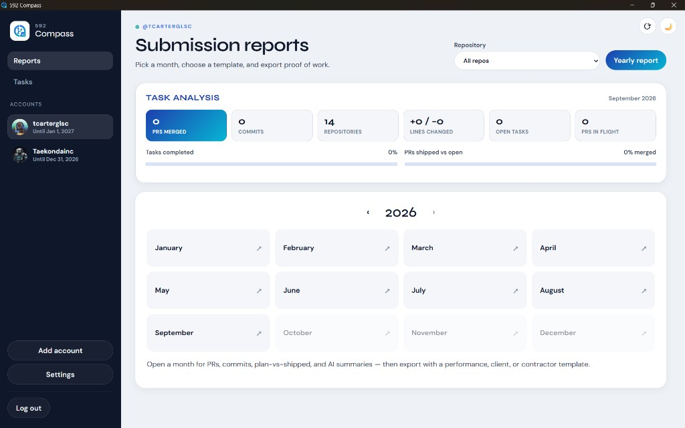

# Vantage — Desktop Releases

**Vantage** is a desktop app for turning your GitHub activity into clear monthly and yearly work reports — with AI summaries, objectives/targets, task integrations (Linear, Jira, GitHub Issues, Asana), submission templates, and evidence packs.



Official builds for **Windows**, **macOS**, and **Linux**. Source code: [vantage](https://github.com/tristoncarter34/vantage) (private).

---

## Latest version — 2.3.0

| Platform | Download |
|----------|----------|
| **Windows** (installer) | [Vantage-2.3.0-Windows-Setup.exe](releases/Vantage-2.3.0-Windows-Setup.exe) |
| **Windows** (portable) | [Vantage-2.3.0-Windows-Portable.exe](releases/Vantage-2.3.0-Windows-Portable.exe) |
| **macOS** (Apple Silicon) | [DMG](releases/Vantage-2.3.0-macOS-AppleSilicon.dmg) · [ZIP](releases/Vantage-2.3.0-macOS-AppleSilicon.zip) |
| **macOS** (Intel) | [DMG](releases/Vantage-2.3.0-macOS-Intel.dmg) · [ZIP](releases/Vantage-2.3.0-macOS-Intel.zip) |
| **Linux** | [AppImage](releases/Vantage-2.3.0-Linux.AppImage) · [DEB](releases/Vantage-2.3.0-Linux.deb) |

> **2.3.0** — Rebranded to **Vantage**. Objectives & targets linked to repo/branch with AI achievement analysis, real GitHub branch creation, Jira issue creation from prompts, Claude Code (subscription) as an AI provider alongside Groq, and task integrations (Jira API fix, settings persistence).

---

## Install

### Windows

1. Download **Setup** (recommended) or **Portable**.
2. Run the installer, or double-click the portable `.exe`.
3. If SmartScreen appears: **More info → Run anyway** (app is not code-signed).

### macOS

1. Download the **DMG** for your Mac (Apple Silicon or Intel).
2. Open the DMG and drag **Vantage** to Applications.
3. First launch: **System Settings → Privacy & Security → Open Anyway** if macOS blocks an unsigned app.

### Linux

**AppImage (recommended):**
```bash
chmod +x Vantage-2.3.0-Linux.AppImage
./Vantage-2.3.0-Linux.AppImage
```

**Debian/Ubuntu:**
```bash
sudo dpkg -i Vantage-2.3.0-Linux.deb
```

---

## How to use

1. **Sign in** — click **Continue with GitHub**, then enter the device code shown in the browser tab. A [Personal Access Token](https://github.com/settings/tokens) (`repo` scope) also works.
2. **AI reports** — choose **Groq** (free API key) or **Claude Code** (your Pro/Max subscription via `claude login`) under Settings → AI reports.
3. Pick a **year** and **month**, open a report, export with templates.
4. Use **Tasks** for objectives/targets, local tasks, and synced issues from Linear, Jira, GitHub, or Asana.

---

## All Windows releases

| Version | Installer | Portable |
|---------|-----------|----------|
| **2.3.0** (latest) | [Setup](releases/Vantage-2.3.0-Windows-Setup.exe) | [Portable](releases/Vantage-2.3.0-Windows-Portable.exe) |
| 2.2.1 | [Setup](releases/592-Compass-Beta-2.2.1-Windows-Setup.exe) | [Portable](releases/592-Compass-Beta-2.2.1-Windows-Portable.exe) |
| 2.2.0 | [Setup](releases/592-Compass-Beta-2.2.0-Windows-Setup.exe) | [Portable](releases/592-Compass-Beta-2.2.0-Windows-Portable.exe) |

---

## Requirements

- **Windows 10/11**, **macOS 11+**, or **Ubuntu 20.04+** / Debian-based Linux (64-bit)
- GitHub account
- Internet for GitHub API and optional AI features

---

## Support

- **Releases:** [github.com/Taekondainc/vantage-releases](https://github.com/Taekondainc/vantage-releases)

Built by Triston Carter · Taekonda
